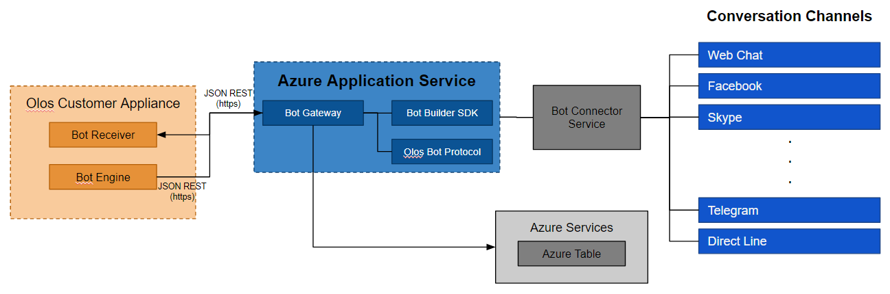

# Introdução

# Olos Bot Gateway

O Olos Bot Gateway é um webApp baseado no [Microsoft Bot Framework](https://docs.microsoft.com/en-us/bot-framework/#pivot=main&panel=overview), trata-se de uma aplicação .Net desenvolvida em C# com a utilização do *Microsoft Bot Framwork SDK* e com a utilização de controllers para integração por meio da disponibilização de uma *API REST*. 
Por meio desta *API REST* o **Olos Bot Gateway** é capaz expor o *endpoint* necessário à integração com a plataforma Microsoft [Bot Framework](https://dev.botframework.com/).
O **Olos Bot Gateway** também disponibiliza mais dois serviços por meio da *API REST*. O primeiro é o serviço destinado à *integração* com o **Olos Bot Receiver**, por meio do qual ele recebe requisições na porta 80 para o encaminhamento de mensagens ao usuário no *canal de comunicação ativo*. O segundo é o serviço destinado à gestão das credenciais dos Bots autorizados a interagir com o **Olos Bot Gateway**.


# Deploy - Olos Bot Gateway 

## Dependências

A gestão de dependências da solução é realizada de forma automática pelo **NuGet Package Manager**. Durante o processo de  *Build* o *NuGet Package Manager* realiza o processo de validação e download dos pacotes necessários à compilação da solução.

Abaixo temos uma visão dos principais componentes.

| Software    | Version      |  Notes                                        |
| ----------- | -------------|  -------------------------------------------- |
| .NetFramework     | v4.6     |                                             |
| Microsoft.Bot.Builder     | v3.8.3     |                                   |
| Microsoft.IdentityModel.Protocol.Extensions     |  v1.0.4.403061554        |
| Newtonsoft.Json     | v8.0.3     |                                         |
| WindowsAzure.Storage     | v8.1.4     |                                    |
| Microsoft.Azure.KeyVault.Core     | v1.0.0 |                               |
| Microsoft.AspNet.WebApi | v5.2.3     |                                     |
| Microsoft.AspNet.WebApi.Core     | v5.2.3     |                            | 
| Autofac     | v4.6.0       |                                               |
| IIS Express     | (última)     |                                           |


# Visão da Arquitetura



## Fluxo de Mensagens


# Configuração

### Configure o web.config

Praticamente todas as configurações relacionadas aos serviços utilizados e disponibilizado pelo **Bot Gateway** são realizadas por meio do arquivo ``web.config``, neste arquivo devem ser configurados os seguintes itens:

|Propriedade                                |Descrição  |Domínio |Obrigatoriedade  |
|-----------------------------------------------|-----------|--------|-----------------|
|UseLocalCredentials                            | Define o comportamento do mecanismo de validação das credenciais dos Bots **atendidos** pela aplicação.          |true; false |   Mandatório    |
|BotId                                          | Identificação do Bot | ID-Alfanumérico  |   Opcional (Caso a a propriedade  UseLocalCredentials seja **preenchida** com **true** este atributo deve ser obrigatoriamente preenchido)     |
|MicrosoftAppId                                 | Identificação do App | GUID          |   Opcional (Caso a a propriedade  UseLocalCredentials seja **preenchida** com **true** este atributo deve ser obrigatoriamente preenchido)     |
|MicrosoftAppPassword                           | Password do App      | GUID          |   Opcional (Caso a a propriedade  UseLocalCredentials seja **preenchida** com **true** este atributo deve ser obrigatoriamente preenchido)     |
|StorageConnectionString                        | String de conexão com o [Azure Table](https://docs.microsoft.com/en-us/azure/storage/storage-dotnet-how-to-use-tables) |          |   Mandatório    |
|GatewayUrl                                     | Url do serviço REST disponibilizado para conexão com o **Olos Bot Engine** | URL (preferencialmente **https**)          |   Mandatório    |
|OlosBotStorageOlosBotCredentialsPartitionKey   | Identificar utilizado na [Azure Table](https://docs.microsoft.com/en-us/azure/storage/storage-dotnet-how-to-use-tables) para agrupar os aplicativos atendidos pelo mesmo **Bot Gateway**      | ID-Alfanumérico |   Mandatório    |
|OlosRegisterAppUserName                    | Usuário exigido para a conexão com a api REST e seus respectivos serviços | Alfanumérico |   Mandatório    |
|OlosRegisterAppUserPasswd                  | Senha exigida para a conexão com a api REST e seus respectivos serviços | Alfanumérico |   Mandatório    |
|LogLevel                                   | Nível de log a ser realizado pelo aplicativo   | None; Information; Warning; Errors; All|   Opcional (Valor *default* **None**)   |

Veja abaixo um exemplo de configuração válida:

```xml
  <appSettings>
    <!-- update these with your BotId, Microsoft App Id and your Microsoft App Password-->
    <add key="BotId" value="" />
    <add key="MicrosoftAppId" value="" />
    <add key="MicrosoftAppPassword" value="" />
    <add key="OlosEngineUri" value="" />
    <add key="UseLocalCredentials" value="false" />
    <add key="StorageConnectionString" value="DefaultEndpointsProtocol=https;AccountName=olosbotstorage;AccountKey=7zl18JlHOCzDBf/Oe57KnBRyqjlr8Qp96IPNyp5H1Soa+zrHe4LSsilAyXO8XY4NRkIYRjks/pOcVteIaqctaQ==" />
    <add key="GatewayUrl" value="https://olosbotapp20170704090820.azurewebsites.net/api/OlosBackStageActivity/OlosSendMessage" />
    <add key="OlosBotStorageOlosBotCredentialsPartitionKey" value="BotCredential" />
    <add key="OlosRegisterAppUserName" value="OlosAppRegister" />
    <add key="OlosRegisterAppUserPasswd" value="UghhFyDc}2@wutEU" />
    <add key="LogLevel" value="None" />
  </appSettings>
```

As per the above example, in case Redis is unavailable, the solution will retry to connect 8640 times, waiting 5 seconds between each retry.
It will give up after 8640 * 5 = 43200 seconds = 12 hours. In future releases, this configuration is supposed to be read from the main Olos database.

> *Note* The `httpPort` configuration is ignored when the solution is running within iisnode.
> The port configured via the IIS GUI is used instead.

Edit the `web.config` file and make sure it has the following environment variables correctly set:

```
    <appSettings>
        <add key="DEBUG" value=""/>
        <add key="NODE_ENV" value="production"/>
    </appSettings>
```

For a complete list of configration parameters available to the iisnode module, please refer to this
sample file: [https://github.com/tjanczuk/iisnode/blob/master/src/samples/configuration/web.config](https://github.com/tjanczuk/iisnode/blob/master/src/samples/configuration/web.config)

## Publicando o Olos Bot Gateway

A publicação do aplicativo para a Azure pode ser realizada por meio da funcionalide **Publish** do projeto no *Microsoft Visual Studio*, entretanto tal publicação exige a configuração de um perfil de publicação, caso o mesmo ainda não esteja configurado.

**External References**

[https://tomasz.janczuk.org/2013/07/application-initialization-of-nodejs.html](https://tomasz.janczuk.org/2013/07/application-initialization-of-nodejs.html)

## Logs de aplicação

A publicação do aplicativo para a Azure pode ser realizada por meio da funcionalide **Publish** do projeto no *Microsoft Visual Studio*, entretanto tal publicação exige a configuração de um perfil de publicação, caso o mesmo ainda não esteja configurado.

## Realização de testes automatizados (JMeter)

A publicação do aplicativo para a Azure pode ser realizada por meio da funcionalide **Publish** do projeto no *Microsoft Visual Studio*, entretanto tal publicação exige a configuração de um perfil de publicação, caso o mesmo ainda não esteja configurado.


# Observações

xxxxxx

# Referências

* [Microsoft Bot Framework](https://docs.microsoft.com/en-us/bot-framework/#pivot=main&panel=overview)
* [Azure Table](https://docs.microsoft.com/en-us/azure/storage/storage-dotnet-how-to-use-tables)
* [Configure Azure Storage connection strings](https://docs.microsoft.com/en-us/azure/storage/storage-configure-connection-string)
* [Get started with Storage Explorer (Preview)](https://docs.microsoft.com/en-us/azure/vs-azure-tools-storage-manage-with-storage-explorer)
* [Create a bot with the Azure Bot Service](https://docs.microsoft.com/en-us/bot-framework/azure/azure-bot-service-quickstart)
* [Deploy bots](https://docs.microsoft.com/en-us/bot-framework/deploy-bot-overview)
* [Deploy a bot to Azure from Visual Studio](https://docs.microsoft.com/en-us/bot-framework/deploy-bot-visual-studio)
* [Debug bots with emulator](https://docs.microsoft.com/en-us/bot-framework/debug-bots-emulator)
* [Bot Emulator Download](https://github.com/Microsoft/BotFramework-Emulator/releases/tag/v3.5.29)
* [Register a bot](https://docs.microsoft.com/en-us/bot-framework/portal-register-bot)
* [Configure channels](https://docs.microsoft.com/en-us/bot-framework/portal-configure-channels)
* [Enable Analytics](https://docs.microsoft.com/en-us/bot-framework/portal-analytics-overview)
* [Set up staging environments in Azure App Service](https://docs.microsoft.com/en-us/azure/app-service-web/web-sites-staged-publishing)
* [Troubleshooting general problems](https://docs.microsoft.com/en-us/bot-framework/troubleshoot-general-problems)
